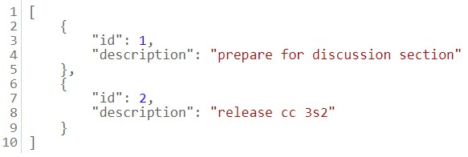

# MVC-Resful
***
## Configuración
Primero instalamos sinatra y puma con los siguientes comandos
```Shell
gem install sinatra
gem install puma
```
Luego bundle y corremos el programa
```
cd sinatra-intro/
bundle install
ruby template.rb # O: bundle exec ruby template.rb
```
Ingresamos el siguiente enlace http://localhost:4567/todos en nuestro navegador para ver la página web y comprobar que esté funcionando. Este debería ser el resultado



El comando curl activa una solicitud `GET` para recuperar la lista de "cosas por hacer" y debería recibir una respuesta que se muestra en la salida estándar de la línea de comando.
```Shell
curl http://localhost:4567/todos
```
Este es el resultado en la terminal:
```Shell
[{"id":1,"description":"prepare for discussion section"},{"id":2,"description":"release cc 3s2"}]
```
***
## Parte 1
Usaremos `ActiveRecord` sobre una base de datos SQLite. En esta aplicación, ¿cuál será nuestro modelo y qué operaciones CRUD le aplicaremos?

***
## Parte 2
A continuación, creemos algunas rutas para que los usuarios puedan interactuar con la aplicación. Aquí hay una URL de ejemplo:
```
https://www.etsy.com/search?q=test#copy
```
Primero, especifica qué partes de la URL son componentes según la discusión sobre la forma de una URL. Consulta esta publicación de IBM que detalla los componentes de una URL.

- https:// : Es el esquema que define el protocolo que se va a usar para acceder al recurso en internet
- etsy : Identifica el nombre del host o dominio que suele seguir de un número de puerto pero la mayoría de URLs HTTP omiten este último. 
- 443 : 
- /search : La ruta que identifica un recurso en específico del host el cual un usuario desea acceder
- q=test :
- copy : El "fragment identifier" se utiliza para apuntar un explorador web a una referencia o función en el elemento que acaba de recuperar

***
## Parte 3
Dado que HTTP es un protocolo RESTful, cada solicitud debe ir seguida de una respuesta, por lo que debemos devolver una vista o redirigir a cada solicitud. Usaremos JSON para las respuestas, que es similar a lo que hacen muchas API. ¿Hacia dónde debería ir la respuesta?


